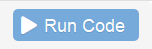

```{r setup, include=FALSE}
library(learnr)
library(parsons)
checker <- function(label, user_code, check_code, envir_result, evaluate_result, ...) {
  list(message = check_code, correct = TRUE, location = "append")
}
tutorial_options(exercise.timelimit = 60, exercise.checker = checker)


knitr::opts_chunk$set(echo = FALSE)
system.file("data","zelda.rds",package = "docklearn")
# zelda <- readr::read_rds(path = "www/zelda.rds")
zelda <- readr::read_rds(path = system.file("data","zelda.rds",package = "docklearn"))
```


```{r eval=FALSE,echo=FALSE}
DT::datatable(zelda)
```


# truc 1 

## Qu'est-ce que R ?

R est un langage utilisé pour le traitement de données statistiques, dont la première version a été publiée en février 2000. D'abord principalement diffusé parmi les chercheurs, R est aujourd'hui de plus en plus utilisé au sein des Instituts nationaux de statistiques.

À la différence d'autres logiciels comme SAS, R est un **logiciel libre** : sa licence d'utilisation est gratuite et autorise chaque utilisateur à **accéder, modifier ou redistribuer son code source**. 

<!-- Une des conséquences de cette philosophie "libre" est le rôle qu'y jouent les modules complémentaires, ou **packages**. Ces packages enrichissent considérablement les fonctionnalités du logiciel : comme d'avoir une calculatrice à laquelle on peut ajouter de nouveaux boutons pour la personnaliser pour ses besoins... -->

Sous ces lignes se trouve une **console** R et, à la manière d'une calculatrice, il est possible de lui demander de réaliser des calculs pour nous : tapez ci-dessous, dans la console, un calcul tel que `2 + 2` et appuyez sur le bouton bleu 

```{r two-plus-two2, exercise=TRUE}
zelda
```

R vous répond `4` et heureusement ! A l'avenir nous allons lui faire faire des choses beaucoup plus compliquées...

Notez que quand R répond à vos demandes, il commence toutes ses "phrases" par un numero de ligne, ici `[1]`

Voici une console un peu plus grande qui contient des instructions pré-remplies, exécutez-les pour voir comment R structure sa réponse à votre sollicitation :

```{r several_instructions, exercise=TRUE, exercices.lines = 10}
2 + 2
12345678 * 4
"du texte entre guillemets"
```


La console est un lieu de dialogue, vous commandez et R s'exécute. Parfois, la communication passe mal, R ne vous comprend pas

```{r error_is_ok, exercise=TRUE}

```

### Exercise with Code

*Here's an exercise with some prepopulated code as well as `exercise.lines = 5` to provide a bit more initial room to work.*

Now write a function that adds any two numbers and then call it:

```{r add-function, exercise=TRUE, exercise.lines = 5}
add <- function() {
  
}
```

## Topic 2

### Exercise with Hint

*Here's an exercise where the chunk is pre-evaulated via the `exercise.eval` option (so the user can see the default output we'd like them to customize). We also add a "hint" to the correct solution via the chunk immediate below labeled `print-limit-hint`.*

Modify the following code to limit the number of rows printed to 5:

```{r print-limit, exercise=TRUE, exercise.eval=TRUE}
mtcars
```

```{r print-limit-hint}
head(mtcars)
```

### Quiz

*You can include any number of single or multiple choice questions as a quiz. Use the `question` function to define a question and the `quiz` function for grouping multiple questions together.*

Some questions to verify that you understand the purposes of various base and recommended R packages:

```{r quiz}
quiz(
  question("Which package contains functions for installing other R packages?",
    answer("base"),
    answer("tools"),
    answer("utils", correct = TRUE),
    answer("codetools")
  ),
  question("Which of the R packages listed below are used to create plots?",
    answer("lattice", correct = TRUE),
    answer("tools"),
    answer("stats"),
    answer("grid", correct = TRUE)
  )
)
```


Mettre les blocs dans le bon ordre  :

```{r banana3} 
question_parsons(
  initial = c(
    "iris",
    "mutate(...)",
    "summarize(...)",
    "print()"
  ),
  pass_if(
    c(
      "iris",
      "mutate(...)",
      "summarize(...)"
    )
  ),
  fail_if(
    ~length(.) < 2,
    message = "Include at least two answers"
  ),
  fail_if(
    function(x){"print()" %in% x},
    message = "You should not include print() in your answer"
  ),
  fail_if(
    ~{.[1] != "iris"},
    message = "Your solution should start with 'iris'"
  )
)
```

